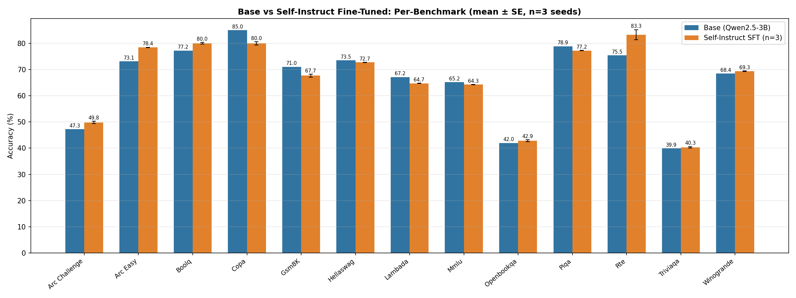
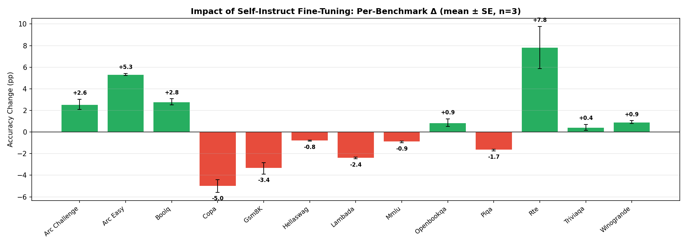
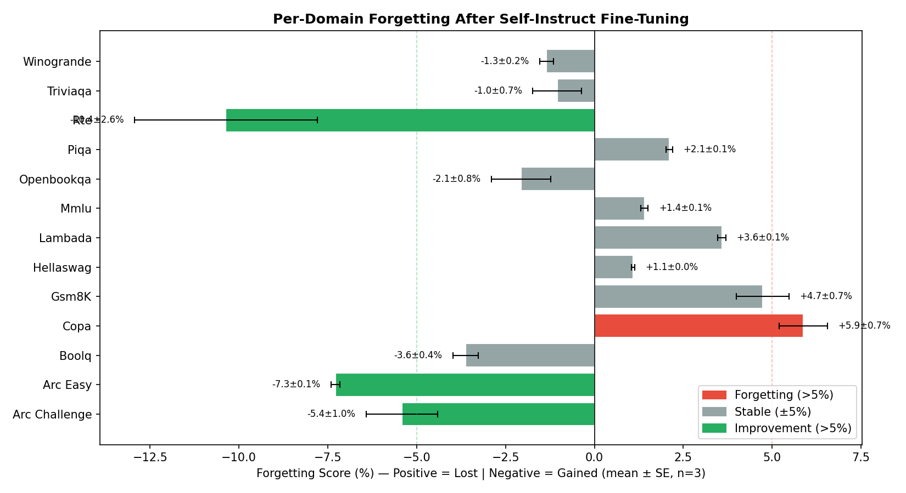
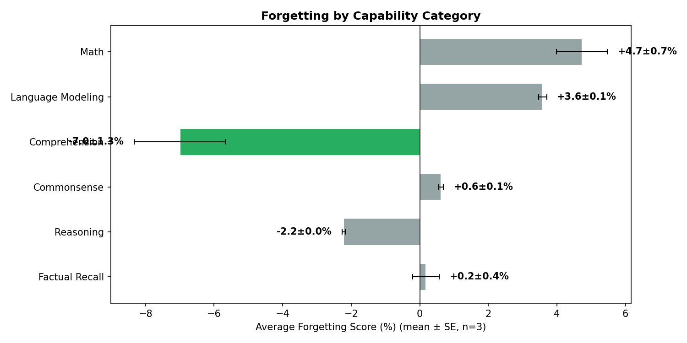
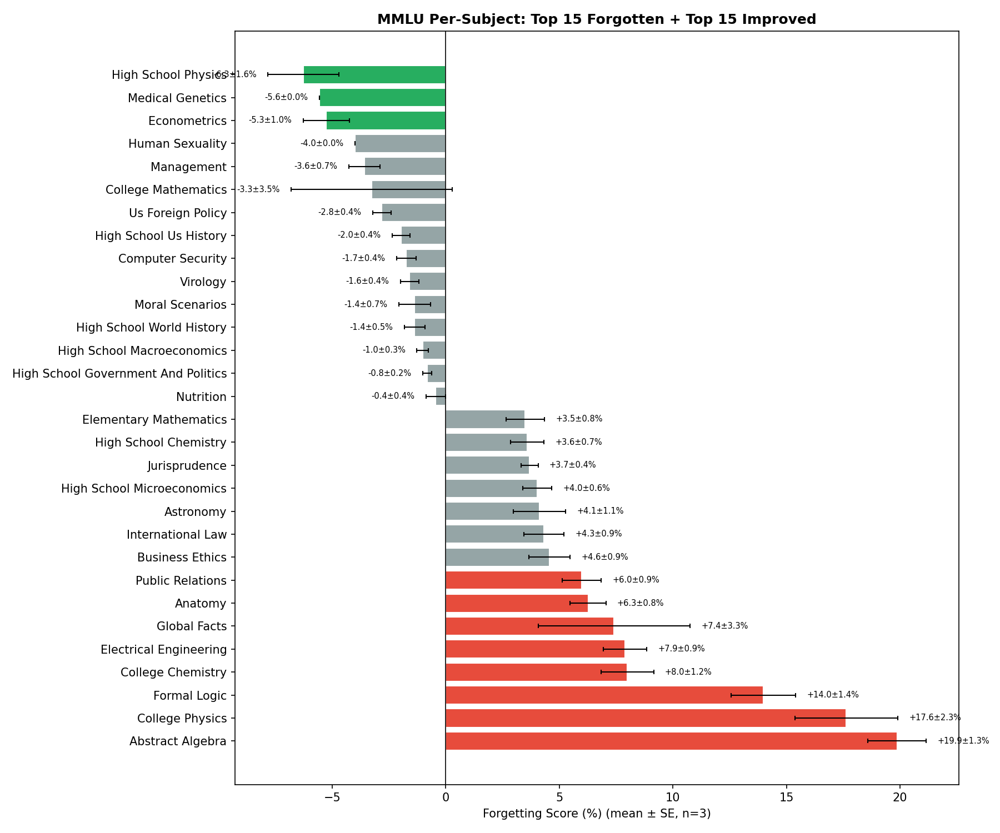
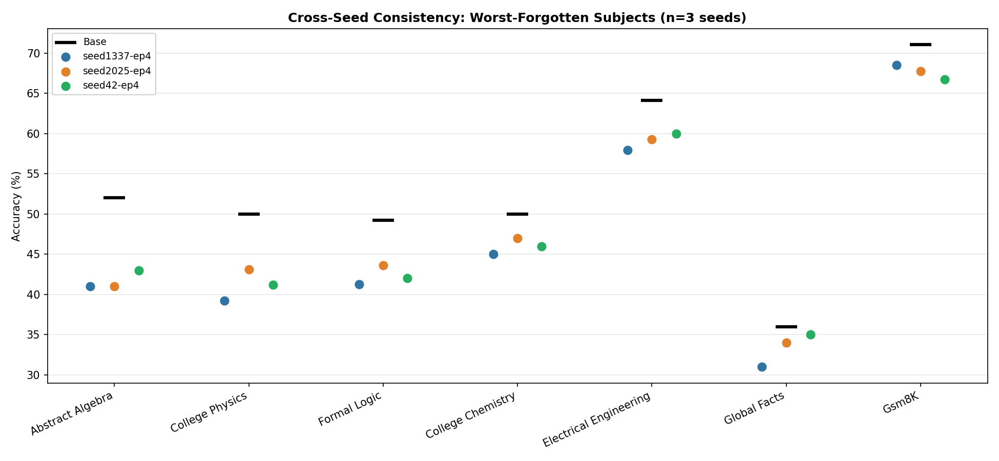

# Self-Instruct Forgetting Experiment

Replication of [Self-Instruct (Wang et al. 2023)](https://arxiv.org/abs/2212.10560) on
Qwen2.5-3B (originally Mistral-7B), measuring catastrophic forgetting after instruction
fine-tuning and testing an adaptive self-rehearsal mechanism to mitigate it.

---

## What This Is

The experiment has three phases:

**Phase 1 — Motivation:** Fine-tune a base LLM on 2,000 self-generated instructions and
benchmark it before and after to quantify how much forgetting occurs, and whether it is
domain-specific.

**Phase 2 — Adaptive SFT:** Add a probe-based monitoring mechanism that detects when a
domain is being forgotten during training and re-weights the training data to compensate.
Compare 3 paired seeds of vanilla SFT vs adaptive SFT.

**Phase 3 — Scale comparison:** Run the same pipeline on 52K Alpaca instructions to see
whether forgetting scales with instruction volume.

---

## Repository Structure

```
self_instruct/
│
├── Core pipeline scripts (run on the GPU server)
│   ├── setup.sh                  — one-time env setup; installs dependencies, creates dirs
│   ├── check_gpu.sh              — check GPU is free before starting (shared server)
│   ├── bootstrap.py              — generate 10K instructions via Self-Instruct loop
│   ├── benchmark_base.sh         — lm-eval benchmarks on the base model
│   ├── finetune.py               — full SFT (vanilla) on self-generated instructions
│   ├── benchmark_instruct.sh     — lm-eval benchmarks on the fine-tuned model
│   ├── run_seeds.sh              — run vanilla SFT across seeds {42, 1337, 2025}
│   ├── compare.py                — print per-task forgetting table (base vs instruct)
│   └── visualize.py              — generate 5 comparison figures
│
├── Adaptive extension
│   ├── build_probe_set.py        — build 150-question probe set (5 domains × 30 questions)
│   ├── instruction_classifier.py — classify instructions into domains via regex
│   ├── finetune_adaptive.py      — adaptive SFT (probe monitoring + sampler reweighting)
│   ├── run_adaptive_seeds.sh     — run adaptive SFT across 3 seeds + benchmark each
│   ├── compare_ablation.py       — paired comparison: vanilla vs adaptive
│   └── visualize_ablation.py     — 4 ablation figures including probe trajectory
│
├── Scale comparison
│   └── compare_alpaca52k.py      — 3-way: base vs 2K SFT vs 52K Alpaca SFT
│
├── results/
│   ├── base/                     — lm-eval JSON outputs for the base model
│   ├── instruct/seed*-ep4/       — vanilla SFT results (3 seeds)
│   ├── adaptive/seed*-ep4-adaptive/ — adaptive SFT results (3 seeds)
│   ├── alpaca52k/seed*-ep1/      — 52K Alpaca SFT results
│   ├── figures/                  — all generated figures (.png)
│   └── ablation_table.json       — machine-readable vanilla vs adaptive comparison
│
├── probes/
│   └── probe_set.json            — 150 held-out multiple-choice probes (5 domains)
│
├── figures/                      — extra figures (legacy / intermediate)
├── server_backup/                — local mirror of the GPU server working directory
├── final_backup/                 — final results snapshot from the server
│
└── CLAUDE.md / UPDATE.md         — instructions used by Claude Code to generate scripts
```

---

## Pipeline Walk-Through

### Phase 1: Vanilla SFT

```
bootstrap.py  →  finetune.py  →  compare.py / visualize.py
```

1. **`bootstrap.py`** generates instructions iteratively: sample 8 tasks from the pool,
   prompt the model to generate new ones, filter by ROUGE similarity (threshold 0.7), classify
   as instruction-following vs classification, generate input/output instances. Saves every 100
   accepted samples and resumes on restart.

2. **`finetune.py`** runs full SFT (not LoRA) on the generated data. Uses Alpaca-style prompt
   formatting, gradient checkpointing, fp16/bf16, and saves checkpoints every 200 steps so
   training is resumable after disconnect.

3. **`compare.py`** loads lm-eval result JSONs from `results/base/` and `results/instruct/`,
   prints a forgetting table with per-task deltas and a forgetting-score column (positive =
   capability lost, negative = gained).

4. **`visualize.py`** generates 5 figures:
   - `comparison.png` — grouped bar chart, base vs fine-tuned
   - `forgetting.png` — horizontal bar chart of per-task forgetting scores
   - `delta_waterfall.png` — signed delta per benchmark
   - `mmlu_subject_forgetting.png` — top-15 most-forgotten and most-improved MMLU subjects
   - `category_forgetting.png` — domain-level rollup (Factual Recall, Reasoning, Commonsense, etc.)

### Phase 2: Adaptive Self-Rehearsal

```
build_probe_set.py  →  instruction_classifier.py  →  finetune_adaptive.py
                                                   →  compare_ablation.py / visualize_ablation.py
```

The adaptive mechanism works as follows:

- **Probe set** (built once): 150 multiple-choice questions across 5 domains (`formal_quant`,
  `math_words`, `causal_commonsense`, `comprehension`, `factual`) sampled from HF dataset
  *train* splits so there is no overlap with the lm-eval test sets.

- **Instruction domains** (classified once): each training instruction is mapped to one of the
  5 probe domains (or `other`) via regex patterns in `instruction_classifier.py`.

- **`finetune_adaptive.py`** replaces the uniform DataLoader with a weighted sampler
  (`AdaptiveDataset`). Every `PROBE_EVAL_EVERY=25` steps, `AdaptiveCallback` evaluates probe
  accuracy per domain. If a domain drops more than `FORGETTING_THRESHOLD=10pp` below its
  baseline for 2 consecutive evaluations, the sample weights of in-domain instructions are
  multiplied by `REWEIGHT_FACTOR=1.5` and renormalized. The probe trajectory is saved to
  `probe_trajectory.json` alongside the model checkpoint.

- **`compare_ablation.py`** does a paired comparison (same seeds) of vanilla vs adaptive,
  reporting mean ± SE of per-task accuracy differences. A ★ flag marks tasks where the
  difference exceeds 2 SE.

- **`visualize_ablation.py`** generates 4 figures:
  - `ablation_toplevel.png` — 3-way bar chart (base / vanilla / adaptive)
  - `ablation_paired_diff.png` — per-task signed delta (adaptive − vanilla)
  - `ablation_key_subjects.png` — recovery of worst-forgotten MMLU subjects
  - `ablation_probe_trajectory.png` — per-domain probe accuracy over training steps with
    intervention markers

### Phase 3: Scale Comparison

`compare_alpaca52k.py` produces a 3-way comparison (base vs 2K self-instruct vs 52K Alpaca)
and 4 figures in `final_backup/figures_52k/`. The key finding it tests is whether forgetting
on reasoning tasks (GSM8K, ARC-Challenge, formal MMLU subjects) amplifies with instruction
volume while recall tasks (BoolQ, TriviaQA) continue to improve.

---

## Benchmarks Evaluated

All benchmarks run via `lm-eval-harness`:

| Task | Metric | Category |
|---|---|---|
| ARC-Challenge / ARC-Easy | acc\_norm | Reasoning |
| HellaSwag | acc\_norm | Commonsense |
| BoolQ, RTE, COPA | acc | Comprehension |
| MMLU (57 subjects) | acc | Factual / domain knowledge |
| WinoGrande, PIQA, OpenBookQA | acc | Commonsense |
| LAMBADA | acc | Language modeling |
| GSM8K | exact\_match | Math |
| TriviaQA | exact\_match | Factual recall |

---

## Results

### Base vs Fine-Tuned: Per-Benchmark Accuracy



### Per-Task Delta (Accuracy Change in Percentage Points)



### Per-Task Forgetting Scores



### Forgetting by Capability Category



### MMLU Per-Subject: Top 15 Forgotten vs Top 15 Improved



### Seed Consistency (Vanilla SFT, 3 Seeds)



---

## Resumability

Every long-running script is designed to survive disconnects on the shared server:

| Script | Resumability |
|---|---|
| `bootstrap.py` | Saves checkpoint every 100 accepted instructions; restarts from existing file |
| `finetune.py` | Saves checkpoint every 200 steps; resumes automatically from latest checkpoint |
| `finetune_adaptive.py` | Same checkpoint cadence as `finetune.py` |
| `benchmark_*.sh` | `lm-eval` re-runs cleanly; no state needed |

For maximum safety against disconnects, run long jobs under `tmux` and prefix with `nohup`:

```bash
nohup python bootstrap.py > logs/bootstrap.log 2>&1 &
tail -f logs/bootstrap.log
```

---

## Server Run Order

```bash
# On GPU server (RTX 3090 24GB, Ubuntu 22.04), inside tmux:

bash check_gpu.sh          # verify GPU is free (shared server)
bash setup.sh              # one-time env + dependency install

# Phase 1
bash benchmark_base.sh     # ~2-3 hr
python bootstrap.py        # ~8-15 hr, RESUMABLE
bash run_seeds.sh          # 3× (finetune ~3-5hr + benchmark ~2-3hr) = ~20 hr
python compare.py
python visualize.py

# Phase 2 (adaptive)
python build_probe_set.py
python instruction_classifier.py
bash run_adaptive_seeds.sh  # ~14 hr total
python compare_ablation.py
python visualize_ablation.py

# Retrieve results
# (on local machine)
scp -r llm@SERVER:/path/results ~/forgetting-results
```

---

## Design Notes and Limitations

- **Probe set size (30/domain):** Gives ~9pp binomial standard deviation, making the 10pp
  absolute forgetting threshold defensible. Smaller probes would be noise-dominated.

- **Forgetting threshold (10pp, 2 consecutive evals):** Conservative to reduce false positives;
  a rigorous design would use noise-calibrated thresholds (k × σ_binomial).

- **Reweight factor (1.5×):** Conservative; can re-trigger and compound. 2× risks
  over-correction; 1.2× may not move the needle.

- **Instruction classification (keyword regex):** Fast and reproducible but imperfect.
  A stronger approach would use the base model as a one-shot classifier.

- **No weight decay:** Domain boost weights persist until the end of training, which may
  bias later epochs toward domains that triggered early interventions.

- **Full SFT, not LoRA:** Chosen for methodological simplicity and to maximize the forgetting
  signal. LoRA typically preserves base capabilities better and would weaken the motivation.

---

## Key Files at a Glance

| File | Lines | Role |
|---|---|---|
| `bootstrap.py` | ~180 | Self-Instruct generation loop |
| `finetune.py` | ~60 | Vanilla SFT (Qwen2.5-3B) |
| `finetune_adaptive.py` | ~220 | Adaptive SFT with probe monitoring |
| `build_probe_set.py` | ~80 | One-time probe set construction |
| `instruction_classifier.py` | ~60 | Regex-based domain classification |
| `compare.py` | ~25 | Forgetting table |
| `compare_ablation.py` | ~100 | Paired vanilla vs adaptive table |
| `visualize.py` | ~100 | 5 motivation figures |
| `visualize_ablation.py` | ~130 | 4 ablation figures |
| `compare_alpaca52k.py` | ~170 | 3-way scale comparison + 4 figures |
